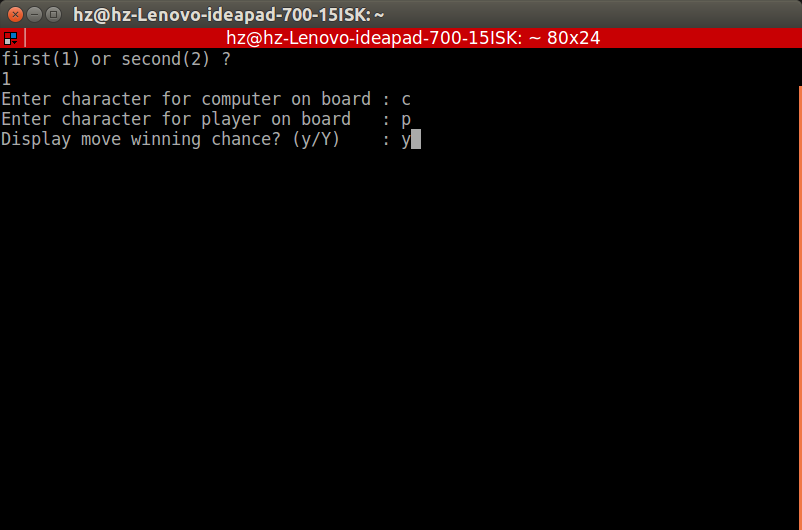
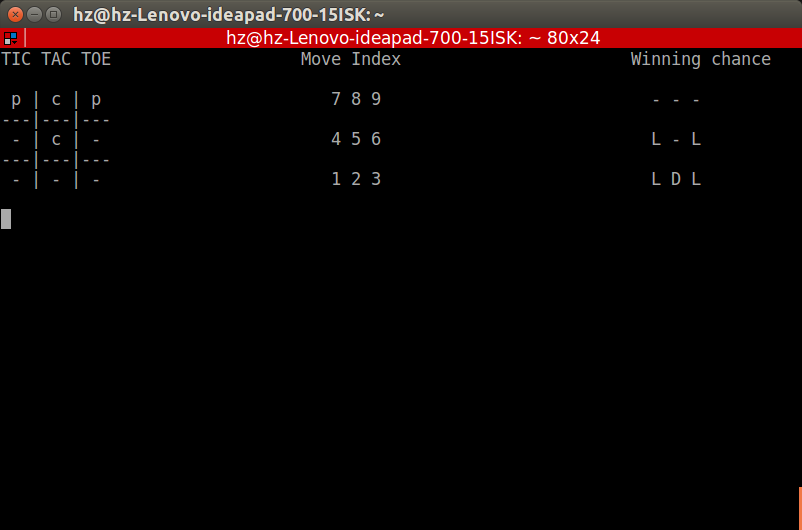
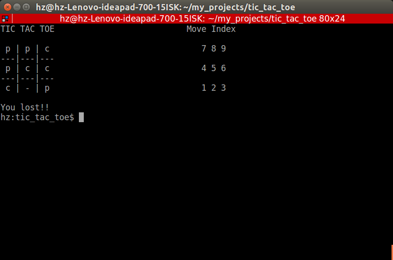

# TicTacToe-AI-Tutorial

### Install the program from pip using:
```
pip install tic_tac_toe
```

- To run a single player mode, type: (the single player mode is by default)
  ```
  tic_tac_toe --mode s
  ```

- To run a two player mode, type:
  ```
  tic_tac_toe --mode t
  ```

- To get help, type:
  ```
  tic_tac_toe --help
  ```

### Screenshots:






