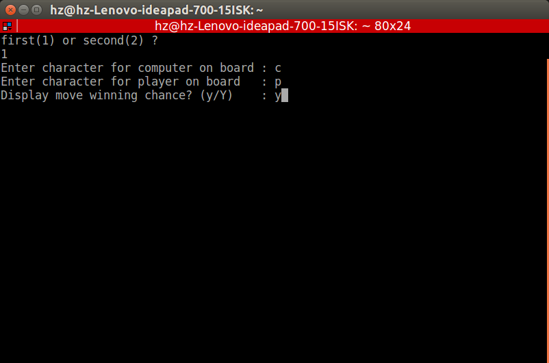
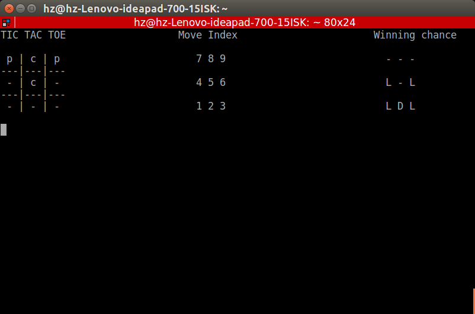
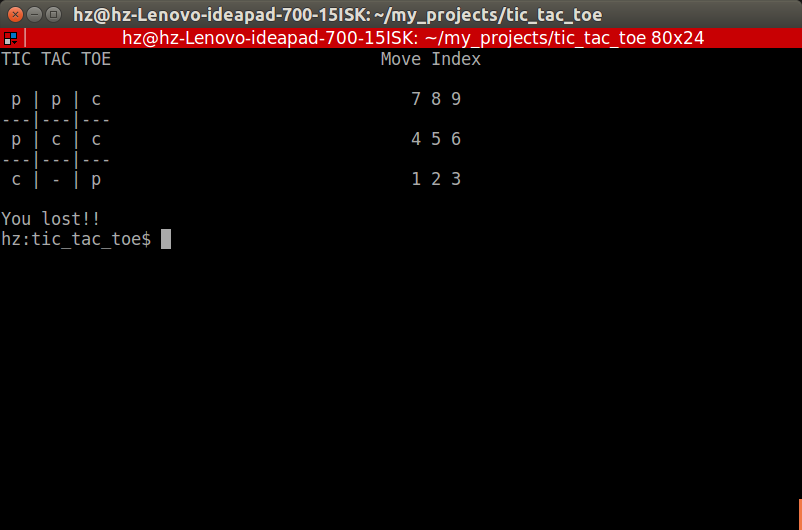

# TicTacToe-AI-Tutorial

### Install from pip:
```
pip install tic_tac_toe
```

### Install locally for development:
```
git clone https://github.com/HusainZafar/tic_tac_toe.git
cd tic_tac_toe
pip install -e .
```

This installs the package in editable mode — any changes you make to the source code will take effect immediately without reinstalling.

### Run tests:
```
pip install pytest
pytest tests/ -v
```

### Run linter:
```
pip install ruff
ruff check .
```

- To run a single player mode, type: (the single player mode is by default)
  ```
  tic_tac_toe --mode s
  ```

- To run a two player mode, type:
  ```
  tic_tac_toe --mode t
  ```

- To get help, type:
  ```
  tic_tac_toe --help
  ```

### Demo:
[](https://www.youtube.com/watch?v=jl7qYpLRXPM "Video Title")

### Screenshots:






